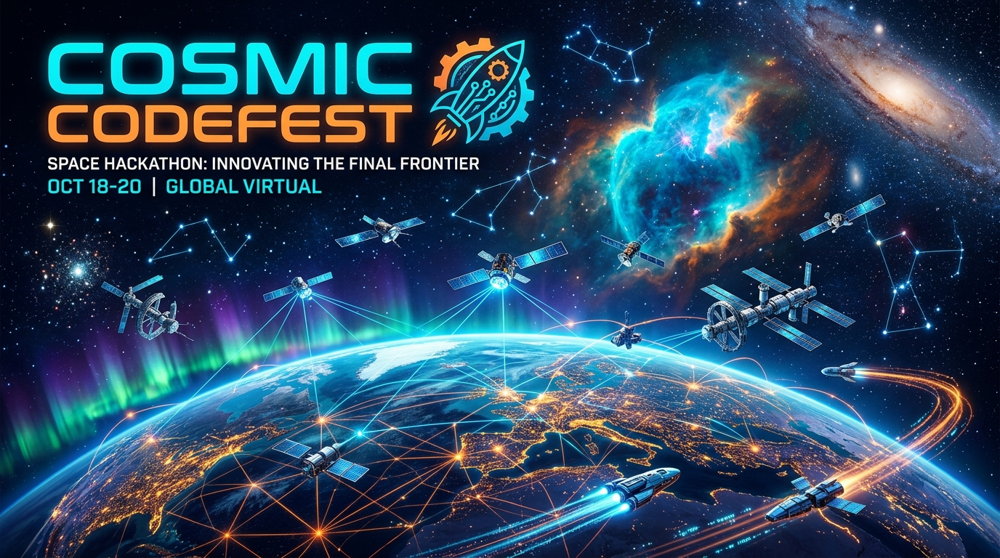

# 🚀 NASA Space Apps Challenge 2026 • Guia Oficial & Hub Brasil 🇧🇷

<div align="center">



[](https://www.spaceappschallenge.org/)
[](https://www.spaceappschallenge.org/2026/)
[](https://www.spaceappschallenge.org/2026/)
[](https://www.spaceappschallenge.org/2026/local-events/)
[](LICENSE)
[](https://wa.me/5585986794831)

**O maior hackathon global do planeta Terra — Conectando estudantes, cientistas, designers e desenvolvedores para solucionar desafios espaciais e terrestres com dados abertos da NASA.**

[🌐 Explorar Site Interativo](#-site-interativo-do-projeto) • [🎯 14 Desafios de 2026](#-as-categorias-e-os-14-desafios-oficiais-de-2026) • [📍 Eventos no Brasil](#-eventos-locais-no-brasil-2026) • [📝 Passo a Passo](#-passo-a-passo-como-o-estudante-participa) • [🏆 Premiação Global](#-critérios-de-avaliação-e-os-10-prêmios-globais)

---

</div>

## 🌌 O que é o NASA Space Apps Challenge?

O **NASA International Space Apps Challenge** é o maior hackathon colaborativo do mundo. Fundado em 2012 pela **NASA (National Aeronautics and Space Administration)** por meio da sua *Science Mission Directorate*, o evento convida dezenas de milhares de participantes em mais de 180 países a utilizarem **dados públicos e abertos (Open Data)** da NASA e de suas agências espaciais parceiras para resolver problemas reais na Terra e no espaço.

### 🌟 Destaques Principais
- **100% Gratuito:** Qualquer pessoa pode participar sem nenhuma taxa.
- **Multidisciplinar e Aberto a Todos:** Você **não precisa saber programar**. As equipes mais fortes unem desenvolvedores, designers, cientistas, estudantes do ensino fundamental, médio e superior, professores, contadores de histórias e entusiastas.
- **Equipes de 1 a 6 pessoas:** Você pode competir sozinho ou em grupos formados antes ou durante o evento.
- **Dados Reais de Missões Espaciais:** Acesso a satélites (Landsat, NISAR, SWOT, Hubble, James Webb), dados climáticos, modelos planetários e APIs abertas.
- **Agências Espaciais Parceiras:** Além da NASA, participam agências globais, incluindo a **ESA** (Europa), **JAXA** (Japão), **CSA** (Canadá) e a **AEB (Agência Espacial Brasileira)**.

---

## 📅 Edição 2026: "The Next Frontier"

* **Data do Hackathon Global:** **14 e 15 de Novembro de 2026** *(48 horas intensivas de inovação)*.
* **Tema Oficial de 2026:** *"The Next Frontier"* (A Próxima Fronteira) — Explorando novos horizontes na ciência planetária, observação da Terra, inteligência artificial aplicada ao espaço e sustentabilidade.
* **Página Oficial da Edição:** [spaceappschallenge.org/2026/](https://www.spaceappschallenge.org/2026/)
* **Inscrições:** Abertas no portal oficial da NASA Space Apps.

---

## 🎯 As Categorias e os 14 Desafios Oficiais de 2026

Os desafios do Space Apps não exigem uma categoria prévia de inscrição; sua equipe escolhe um dos **14 desafios oficiais** lançados pela NASA para desenvolver a solução durante o hackathon:

| # | Nome do Desafio | Dificuldade | Área Temática | Objetivo Resumido |
|---|-----------------|-------------|---------------|-------------------|
| 01 | **Abandoned but not Forgotten** | Iniciante / Intermediário | Astrofísica & Exploração Lunar/Marte | Contar a história de equipamentos e rovers da NASA deixados na Lua, Marte e espaço profundo desde os anos 60 para inspirar jovens estudantes. |
| 02 | **Be An Earth System Trend Detective!** | Avançado | Ciências da Terra & Clima | Desenvolver ferramentas analíticas para detectar e prever padrões consistentes em variáveis climáticas globais usando séries temporais da NASA. |
| 03 | **Build a Junior Astronaut Mission Trainer** | Iniciante / Intermediário | Educação, Engenharia & Gamificação | Criar um jogo ou aplicativo interativo que ensine crianças e jovens os compromissos de engenharia espacial (suporte de vida, energia, radiação). |
| 04 | **CLPS Lunar Mission Browser** | Avançado | Missões Lunares & Exploração | Construir uma ferramenta interativa e intuitiva para planejadores de missões CLPS simularem iluminação solar e comunicação na superfície lunar. |
| 05 | **Create Health Monitoring Software for Astronauts** | Intermediário / Avançado | Medicina Espacial & Biometria | Desenvolver software para monitorar a saúde física e mental dos astronautas em missões de longa duração além da órbita terrestre. |
| 06 | **Dancing with the SARs** | Intermediário / Avançado | Satélites Radar (NISAR) & Terra | Utilizar dados de radar de abertura sintética da missão NASA-ISRO para rastrear desmatamento, queimadas, inundações e deformações no solo. |
| 07 | **Flame in Freefall** | Avançado | Microgravidade, IA & Ciência de Materiais | Criar um dashboard interativo com IA para minerar e sintetizar experimentos históricos de combustão em microgravidade na Estação Espacial. |
| 08 | **Identify Earth Locations that Analog Moon and Mars Bases** | Avançado | Análogos Terrestres & Geologia | Mapear e classificar regiões na Terra que possuem características extremas semelhantes aos locais de futuros assentamentos em Marte e no polo sul da Lua. |
| 09 | **Field Shift: Adapting Farms with NASA Data** | Avançado | Agricultura, Satélites & Riscos | Criar uma solução para agricultores combinarem observações de satélite da NASA com dados de solo locais para mitigar riscos climáticos e secas. |
| 10 | **The Earth Information Jukebox** | Iniciante / Intermediário | Acessibilidade, Arte & Sonificação | Transformar dados científicos complexos do Earth Information Center da NASA em som e música imersiva, democratizando o acesso a pessoas com deficiência visual. |
| 11 | **Space Mission Design Game** | Iniciante / Intermediário | Mecânica Orbital & Jogos | Desenvolver um simulador ou jogo que faça o usuário gerenciar orçamentos, trajetórias orbitais, cargas científicas e lançamentos espaciais. |
| 12 | **Living Off the Cosmic Land (ISRU Explorer)** | Intermediário / Avançado | Recursos In-Situ (ISRU) | Criar soluções e maquetes virtuais para extração e processamento de água e oxigênio a partir do regolito lunar e marciano. |
| 13 | **Cosmic Clean-Up: Orbital Debris Tracker** | Intermediário / Avançado | Detritos Espaciais & Astrodinâmica | Visualizar o lixo espacial em órbita baixa da Terra (LEO) e propor estratégias dinâmicas para prevenção de colisões em cascata. |
| 14 | **Open Science for All: Biodiversity & Ocean Watch** | Iniciante / Intermediário | Oceanografia & Biodiversidade | Facilitar a exploração de dados marinhos e de biodiversidade marinha para comunidades ribeirinhas, escolas e pesquisadores da conservação. |

👉 Acesse a lista detalhada e atualizada em: [spaceappschallenge.org/2026/challenges/](https://www.spaceappschallenge.org/2026/challenges/)

---

## 🇧🇷 Eventos Locais no Brasil (Local Events 2026)

O Brasil é um dos países com **maior participação e tradição** no NASA Space Apps Challenge, conquistando múltiplos prêmios globais e menções honrosas ao longo dos anos!

### 🗺️ Polos Confirmados no Brasil para 2026
Estudantes e participantes no Brasil podem escolher sua cidade ou se registrar no **Evento Universal Virtual**:

| Cidade / Polo | UF | Região | Modalidade | Local / Parceiro Destaque |
|---------------|----|--------|------------|----------------------------|
| **Belo Horizonte** | MG | Sudeste | Presencial / Híbrido | PUC Minas — Campus São Gabriel / Rede Santa Maria |
| **Brasília** | DF | Centro-Oeste | Presencial | Hub de Inovação de Brasília / Organização Local |
| **Campinas** | SP | Sudeste | Presencial / Híbrido | Polo de Tecnologia e Inovação de Campinas |
| **Belém** | PA | Norte | Presencial / Híbrido | Centro de Ciência e Tecnologia da Amazônia |
| **Fortaleza** | CE | Nordeste | Presencial | Centro Universitário UniAteneu Lagoa |
| **Curitiba** | PR | Sul | Híbrido | Ecossistema de Inovação do Paraná / Campinas Hub |
| **Londrina** | PR | Sul | Presencial | Polo Tecnológico de Londrina |
| **Caxias do Sul** | RS | Sul | Presencial | Serra Gaúcha Tech Hub |
| **Guarulhos** | SP | Sudeste | Híbrido | Comunidade Hackathon Brasil |
| **Uberlândia** | MG | Sudeste | Presencial | Triângulo Mineiro Inovação |
| **Limeira** | SP | Sudeste | Híbrido | Polo Universitário Limeira |
| **Cavalcante** | GO | Centro-Oeste | Presencial | Savanno Kombucharia & Cerrado Tech |
| **Cianorte** | PR | Sul | Presencial | UMFG College |
| **Vilhena** | RO | Norte | Presencial | Polo de Inovação de Rondônia |
| **Sorocaba** | SP | Sudeste | Presencial / Híbrido | Parque Tecnológico de Sorocaba |
| **🌐 Evento Universal Brasil** | BR | Nacional | 100% Online | Aberto para qualquer estudante de qualquer município! |

> 💡 **Dica para o estudante:** Se a sua cidade não tiver um polo presencial confirmado, **você não fica de fora!** Basta selecionar o **Evento Universal (Virtual)** no site da NASA ao se inscrever. Você concorre aos mesmos prêmios globais que qualquer equipe presencial.

🔗 **Consulte o mapa e todos os polos em:** [spaceappschallenge.org/2026/local-events/](https://www.spaceappschallenge.org/2026/local-events/)

---

## 📝 Passo a Passo: Como o Estudante Participa

1. **Criar Conta Gratuita:** Acesse [spaceappschallenge.org](https://www.spaceappschallenge.org/) e clique em **Sign Up**. Preencha seu e-mail e dados básicos.
2. **Escolher seu Evento Local:** Vá até a página de [Local Events 2026](https://www.spaceappschallenge.org/2026/local-events/), digite o nome da sua cidade no Brasil (ex: *Campinas, Belo Horizonte, Fortaleza*) ou escolha o *Universal Event*. Clique em **Register for this Event**.
3. **Entrar na Comunidade Local:** Verifique na página da sua cidade as instruções dos organizadores locais (alguns polos usam Discord, WhatsApp ou Sympla para credenciamento presencial).
4. **Montar ou Entrar em uma Equipe:** Use a aba **Find a Team** no portal da NASA ou convide amigos (de 1 a 6 integrantes). É recomendado mesclar habilidades (ex: alguém de design, alguém de pesquisa, alguém de desenvolvimento e alguém focado na apresentação).
5. **Escolher um dos 14 Desafios:** Estude a lista e os dados abertos fornecidos pela NASA.
6. **Desenvolver a Solução (14-15 de Novembro):** Durante as 48h, crie um protótipo funcional, maquete conceitual, game, aplicativo ou análise de dados.
7. **Submeter o Projeto:** Antes do prazo final de domingo, sua equipe deve enviar:
   - Resumo da solução;
   - Explicação de como os dados da NASA foram utilizados;
   - Link para o repositório no GitHub ou demo online;
   - Apresentação em slides (máx. 7 slides) ou vídeo pitch (máx. 30 segundos).

---

## 🏆 Critérios de Avaliação e os 10 Prêmios Globais

Os projetos são avaliados primeiramente pelos jurados locais de cada cidade. Os melhores avançam como **Global Nominees** para a banca executiva de cientistas da NASA, que concede os **10 Global Awards**:

1. 🔬 **Best Use of Science:** A solução que faz o uso mais válido e inovador de conceitos científicos.
2. 📊 **Best Use of Data:** A solução que melhor integra e aproveita os dados abertos da NASA e agências parceiras.
3. 💻 **Best Use of Technology:** A aplicação com maior excelência e inovação tecnológica.
4. 🌌 **Galactic Impact:** O projeto com o maior potencial de melhorar a vida na Terra ou expandir o conhecimento no espaço.
5. ✨ **Most Inspirational:** O projeto que mais cativa os corações e a imaginação do público.
6. 🚀 **Best Mission Concept:** O conceito de missão espacial mais viável, estruturado e promissor.
7. 🏡 **Local Impact:** A solução com maior impacto positivo direto para uma comunidade local.
8. 📖 **Best Storytelling:** A melhor narrativa e comunicação científica.
9. 🎨 **Art & Technology:** O projeto que melhor funde criatividade artística e tecnologia espacial.
10. 🌍 **Global Connection:** A solução que conecta de forma mais eficaz pessoas e recursos globais.

---

## 💻 Site Interativo do Projeto

Este repositório acompanha um website moderno, dinâmico e 100% em português com:

- ⏱️ **Contador regressivo ao vivo** para o hackathon de 14 e 15 de novembro de 2026.
- 🔍 **Buscador Dinâmico de Eventos no Brasil:** Permite ao estudante filtrar por cidade, estado (SP, MG, DF, CE, PA, PR, RS, GO, RO) e modalidade (Presencial/Híbrido/Online) com links diretos para inscrição.
- 🎯 **Explorador Interativo dos 14 Desafios:** Filtro por nível de dificuldade e área temática, busca instantânea e resumos detalhados.
- 🌌 **Visual Cósmico Premium:** Starfield animado via Canvas, glassmorphism, modo escuro espacial e micro-animações.
- 📱 **100% Responsivo:** Funciona perfeitamente em celulares, tablets e computadores.

### Como Executar o Site Localmente

Como o projeto é construído em HTML5, CSS3 moderno e Vanilla JavaScript, **não é necessário instalar nenhuma dependência pesada**:

1. Basta clonar o repositório ou baixar os arquivos:
   ```bash
   git clone https://github.com/tiovene/nasa-spaceapps.git
   cd nasa-spaceapps
   ```
2. Abra o arquivo `index.html` diretamente em qualquer navegador moderno (Chrome, Edge, Firefox, Safari) dando um duplo clique.
3. Se preferir rodar em um servidor local com live server ou Python:
   ```bash
   python -m http.server 8080
   ```
   Acesse no navegador: `http://localhost:8080`

### Publicação no GitHub Pages
O site já está estruturado na raiz para ser publicado instantaneamente no GitHub Pages:
- Acesse o repositório no GitHub -> **Settings** -> **Pages** -> Selecione a branch `main` e a pasta `/ (root)`.
- Seu site ficará disponível gratuitamente em: `https://tiovene.github.io/nasa-spaceapps/`

---

## 🔗 Links Úteis Oficiais

- 🌐 **Portal Global da NASA Space Apps:** [spaceappschallenge.org](https://www.spaceappschallenge.org/)
- 🚀 **Edição 2026 da Competição:** [spaceappschallenge.org/2026/](https://www.spaceappschallenge.org/2026/)
- 📋 **Lista Oficial de Desafios 2026:** [spaceappschallenge.org/2026/challenges/](https://www.spaceappschallenge.org/2026/challenges/)
- 📍 **Localizador Global de Eventos:** [spaceappschallenge.org/2026/local-events/](https://www.spaceappschallenge.org/2026/local-events/)
- 📚 **Perguntas Frequentes & Guias Oficiais:** [spaceappschallenge.org/resources/](https://www.spaceappschallenge.org/resources/)
- 🇧🇷 **Agência Espacial Brasileira (AEB):** [gov.br/aeb](https://www.gov.br/aeb/)
- 🛰️ **Instituto Nacional de Pesquisas Espaciais (INPE):** [gov.br/inpe](https://www.gov.br/inpe/)

---

<div align="center">

Feito com paixão pela exploração espacial e ciência aberta • NASA Space Apps Brasil 🇧🇷

</div>